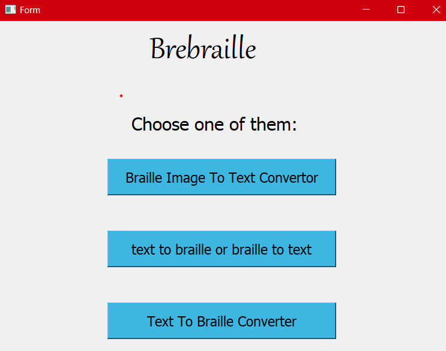
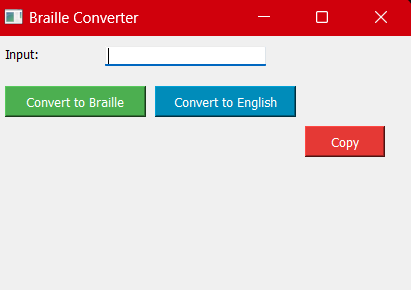
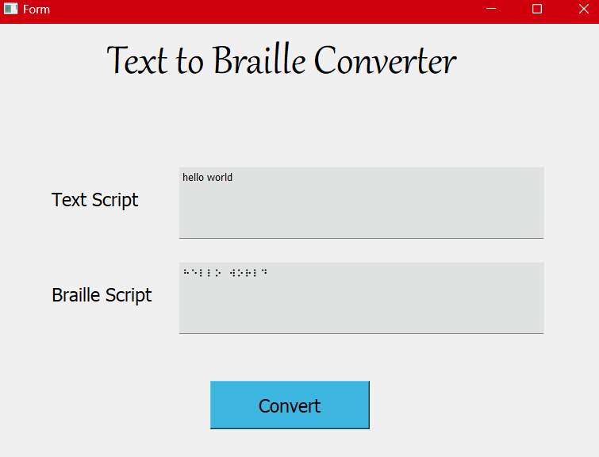
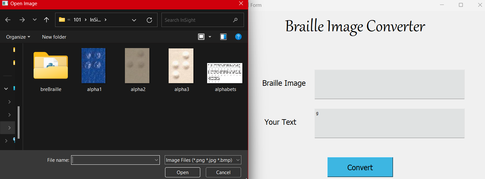

# Braille Converter USING ML 📘🔤📸

This Python script defines a graphical user interface (GUI) for a Braille converter application using the PyQt5 library. The application leverages Machine Learning (ML) and Deep Learning for Braille image-to-text conversion.

## Dependencies 🛠️

- PyQt5 for the main GUI
- Tkinter for an alternative converter
- Pillow (PIL) for image processing
- pytesseract for OCR (Optical Character Recognition)
- pyttsx3 for text-to-speech synthesis

## Functionality ⚙️

### English to Braille Conversion 🇬🇧➡️🔤

- The `ENGLISH_TO_BRAILLE` dictionary maps English alphabets to their corresponding Braille representation.
- The `english_to_braille` function converts an input English text to Braille.

### Braille to English Conversion 🔤➡️🇬🇧

- The `BRAILLE_TO_ENGLISH` dictionary maps Braille characters to their corresponding English alphabets.
- The `braille_to_english` function converts an input Braille text to English.

### Braille Image to English Text 📸➡️🇬🇧

- The application includes a Braille Image to Text converter using Machine Learning and Deep Learning. (Details in the code)

### Text-to-Speech 🗣️

- The `speak_english` function utilizes pyttsx3 to convert English text to speech.

### GUI Components 🖥️

- The main GUI (`Ui_Main`) has buttons to open specific converter windows and a Tkinter-based converter.
- The converter windows (`Ui_Braille_To_Text` and `Ui_Braille_Image_to_text`) provide interfaces for text and image-based Braille conversion.

## Usage 🚀

- Run the script to open the main GUI.
- Choose between Braille Image to Text Converter, Text to Braille Converter, and other functionalities.

## Notes 📝

- Ensure that the required libraries (`PyQt5`, `Pillow`, `pytesseract`, and `pyttsx3`) are installed before running the script.
- The Tkinter-based converter relies on a separate `send.py` script.
